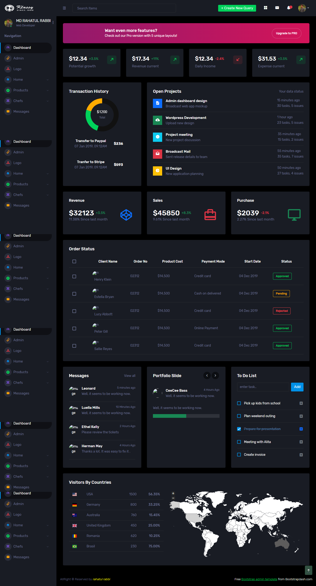
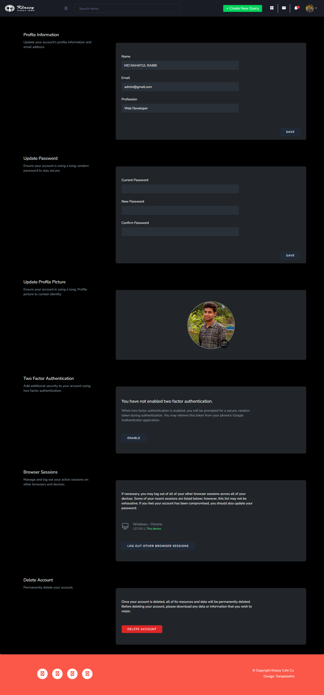
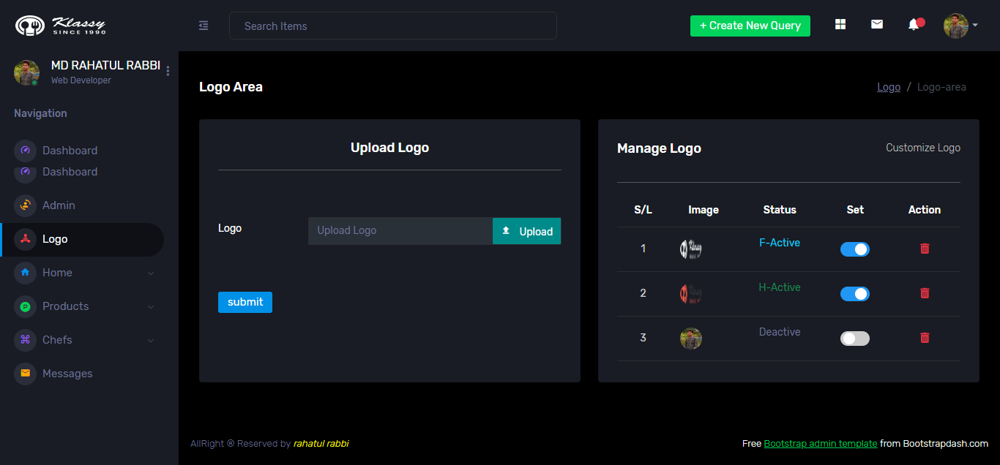
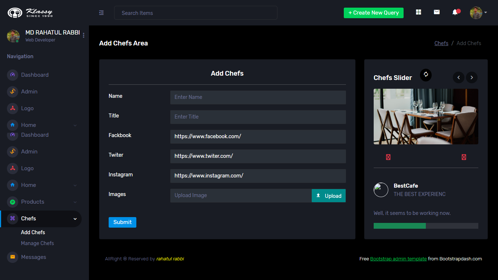
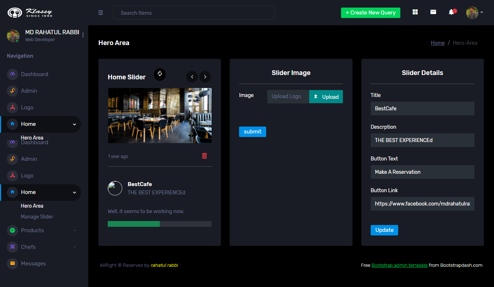
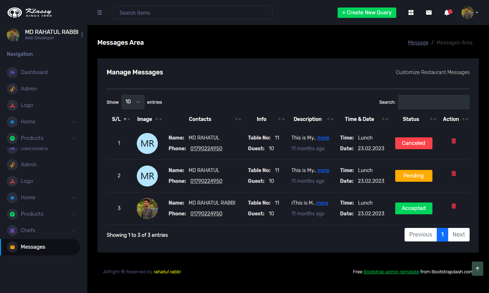
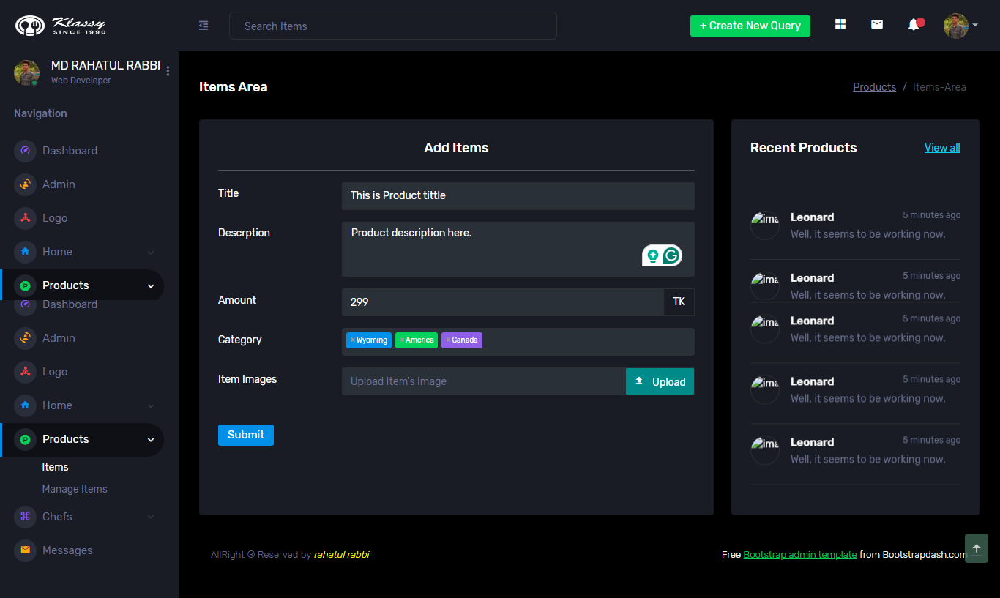
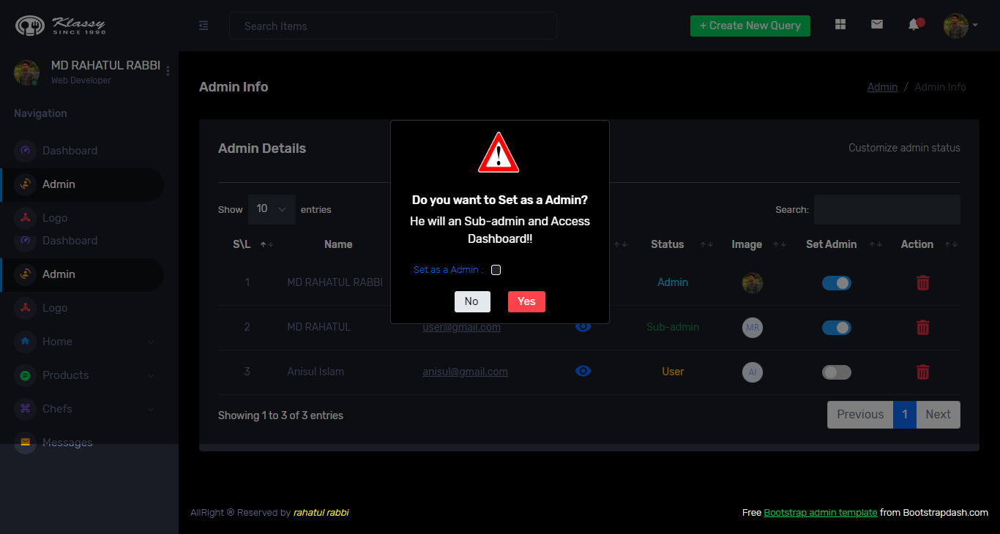
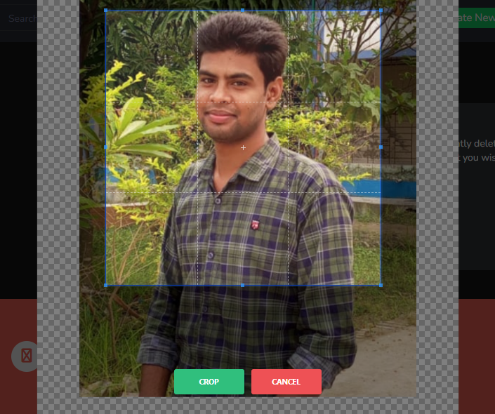
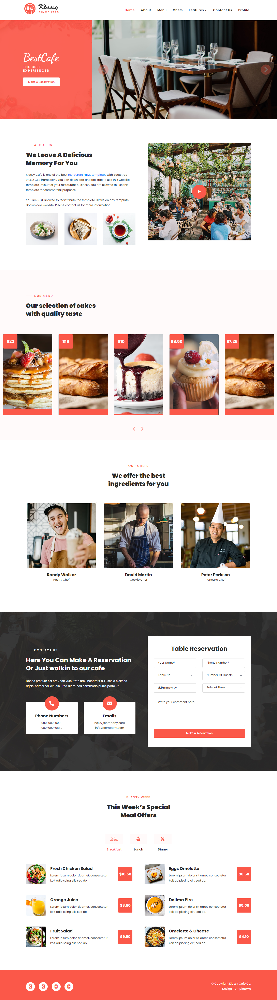

```cmd

npm run dev

```

```cmd

php artisan serve

```

# LARAVEL-RESTAURANT

[![Youtube][youtube-shield]][youtube-url]
[![Facebook][facebook-shield]][facebook-url]
[![Instagram][instagram-shield]][instagram-url]
[![LinkedIn][linkedin-shield]][linkedin-url]

Thanks for visiting my GitHub account!

 Laravel is a free and open-source PHP- based web framework for building high-end web applications. It was created by Taylor Otwell and intended for the development of web applications following the model–view–controller architectural pattern and based on Symfony. [see-more](https://laravel.com/docs/)

## Source Code (Download)

-   [Source-code]()
-   [Documentation](https://mega.nz/folder/RGFiUApD#PoKIVCwF8IkQhE2PHw1XxQ)

## Required Software (Download)

-   VS Code, Download ->https://code.visualstudio.com/download

## Project Features

|                                                    |                                                |
| :------------------------------------------------: | :--------------------------------------------: |
|                     Dashboard                      |                    Profile                     |
|      |    |
|                      Logo-MGT                      |                   Chefs-MGT                    |
|       |  |
|                     Hero-Area                      |                    Message                     |
|  |    |
|                    Product-MGT                     |                   Admin-MGT                    |
|    |  |
|                    Upload-Image                    |
|     |

|                                           |
| :---------------------------------------: |
|                 Dashboard                 |
|  |

## For More

-   [CSS Full Course with a project | Zero to Hero | English Tutorial](https://youtu.be/lXYo52yFLDk)
-   [CSS complete course Bangla (Beginner to Advanced)](https://youtube.com/playlist?list=PLgH5QX0i9K3qjCBXjTmv7Xeh8MDUUVJDO)
-   [CSS eCommerce Project Bangla](https://youtube.com/playlist?list=PLgH5QX0i9K3rsTE0J6lv99JsJHlPlIvSC)

## Follow Me

[](https://github.com/learnwithfair) [](https://www.facebook.com/learnwithfair/) [](https://www.instagram.com/learnwithfair/) [](https://www.twiter.com/learnwithfair/) [](https://www.youtube.com/@learnwithfair)

<!-- MARKDOWN LINKS & IMAGES -->

[youtube-shield]: https://img.shields.io/badge/-Youtube-black.svg?style=flat-square&logo=youtube&color=555&logoColor=white
[youtube-url]: https://youtube.com/@learnwithfair
[facebook-shield]: https://img.shields.io/badge/-Facebook-black.svg?style=flat-square&logo=facebook&color=555&logoColor=white
[facebook-url]: https://facebook.com/learnwithfair
[instagram-shield]: https://img.shields.io/badge/-Instagram-black.svg?style=flat-square&logo=instagram&color=555&logoColor=white
[instagram-url]: https://instagram.com/learnwithfair
[linkedin-shield]: https://img.shields.io/badge/-LinkedIn-black.svg?style=flat-square&logo=linkedin&colorB=555
[linkedin-url]: https://linkedin.com/company/learnwithfair
